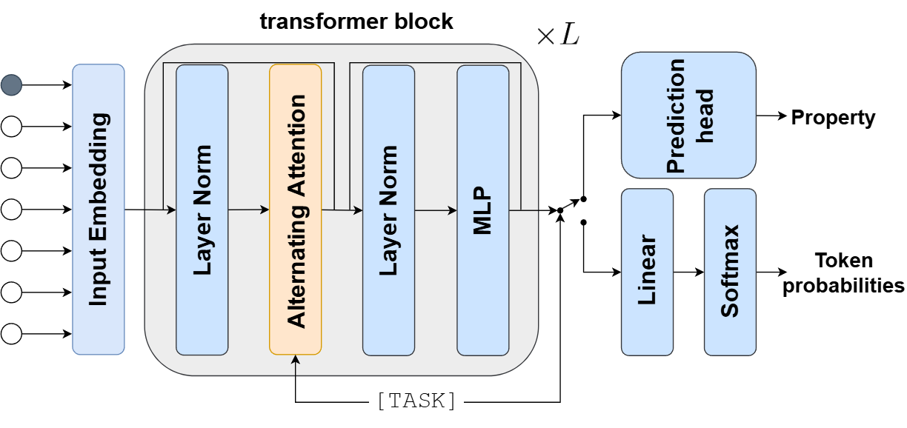

# Hyformer

This repository is the official implementation of [Hyformer](https://arxiv.org/abs/2504.16559). 

Hyformer is a [joint](https://www.microsoft.com/en-us/research/wp-content/uploads/2016/02/LasserreBishopMinka06.pdf) transformer-based model that unifies a generative decoder with a predictive encoder. Depending on the task, Hyformer uses either a causal or a bidirectional mask, outputting token probabilities or predicted property values.




> For an optimized implementation, see [Hyformer 2.0](https://github.com/szczurek-lab/hyformer/tree/jointformer-2.0). 


## Requirements

To create an environment that satisfies the necessary requirements run
```
 conda env create -f hyformer-experiments.yml
```
Next, install Hyformer from the project directory with 
```
conda activate hyformer-experiments
pip install -e .
```

Optionally, for a faster build use [micromamba](https://mamba.readthedocs.io/en/latest/user_guide/micromamba.html) or enable [conda-libmamba-solver](https://www.anaconda.com/blog/conda-is-fast-now) with 
``` 
conda update -n base conda
conda install -n base conda-libmamba-solver
conda config --set solver libmamba
```

## Pre-trained Models

You can download pretrained models from:

> Model download is not available, yet.

- [Hyformer-8M](https://drive.google.com/mymodel.pth) trained on GuacaMol dataset [1].
- [Hyformer-50M](https://drive.google.com/mymodel.pth) trained on 19M molecules from combined: ZINC, ChEMBL and various purchusable molecular datasets [2]. 

### Pre-training from scratch

To pre-train Hyformer, run this command:

```train
python train.py --input-data <path_to_data> --alpha 10 --beta 20
```

## Experiments

Experiments are executable through scripts in `experiments/`.

### GuacaMol distribution learning benchmark

To evaluate the unconditional predictive performance of Hyformer, on GuacaMol benchmark, run 
```train
python train.py --input-data <path_to_data> --alpha 10 --beta 20
```

### Conditional sampling

For the conditional sampling experiment, first jointly fine-tune the model
```train
python train.py --input-data <path_to_data> --alpha 10 --beta 20
```
and generate
```train
python train.py --input-data <path_to_data> --alpha 10 --beta 20
```

### Hit Ideantification (Hi) task from Lo-Hi benchmark

For the Hi task, fine-tune and evaluate the model across 3 independent runs using
```train
python train.py --input-data <path_to_data> --alpha 10 --beta 20
```


### Representation Learning

To evaluate Hyformer's representations, run:

```eval
python eval.py --model-file mymodel.pth --benchmark imagenet
```


## Repository Structure

```
.
├── configs/              # configuration files
├── experiments/          # scripts
└── jointformer/          
    ├── configs/            
    ├── models/             # models
    ├── trainers/           # trainer
    └── utils/           
        ├── datasets/       # datasets
        ├── tokenizers/     # tokenizers
        └── ...             # utilities

```


## References

[1] Brown, Nathan, et al. "GuacaMol: benchmarking models for de novo molecular design." Journal of chemical information and modeling, 2019.
[2] Zhou, Gengmo, et al. "Uni-mol: A universal 3d molecular representation learning framework." ICLR, 2023.