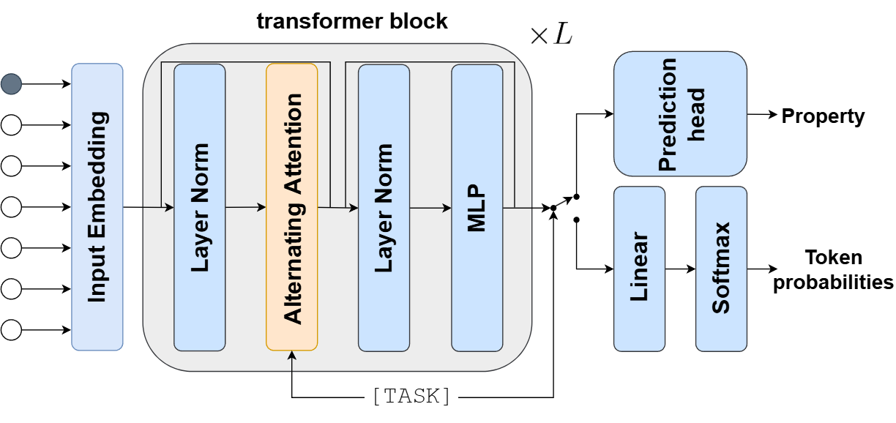

# Hyformer

This repository is an optimized implementation of [Hyformer](https://arxiv.org/abs/2504.16559), a [joint](https://www.microsoft.com/en-us/research/wp-content/uploads/2016/02/LasserreBishopMinka06.pdf) transformer-based model that unifies a generative decoder with a predictive encoder. Depending on the task, Hyformer uses either a causal or a bidirectional mask and returns token probabilities or predicted property values.




## Installation

To create an environment that satisfies the necessary requirements run
```bash
pip install hyformer @ git+https://github.com/szczurek-lab/hyformer.git@v2.0 
```

## Pre-trained Models

Download pre-trained models from [HuggingFace](https://huggingface.co/SzczurekLab/hyformer):

- [hyformer_peptides_34M](https://huggingface.co/SzczurekLab/hyformer_peptides_34M) trained on 3.5M general-purpose and antimicrobial peptides.
- [hyformer_peptides_34M_MIC](https://huggingface.co/SzczurekLab/hyformer_peptides_34M_MIC) `Hyformer_peptides_34M` jointly fine-tuned on minimal inhibitory concentration values (MIC) against E. coli bacteria.

## Usage

### Generation

```python
import torch

from hyformer import AutoModel, AutoTokenizer

device = torch.device('cuda' if torch.cuda.is_available() else 'cpu')
batch_size = 16
seed = 1337
num_samples = 16

tokenizer = AutoTokenizer.from_pretrained('SzczurekLab/hyformer_peptides_34M')
model = AutoModel.from_pretrained('SzczurekLab/hyformer_peptides_34M')

generator = model.to_generator(tokenizer, batch_size, device)

generator.generate(number_samples=num_samples, seed=seed)

```

### Featurization

```python
import torch

from hyformer import AutoModel, AutoTokenizer

device = torch.device('cuda' if torch.cuda.is_available() else 'cpu')
batch_size = 16

sequences = [
    'WGLKLRMRAAGTSYSSAGRRGSAATGATRATTQFPSKR',
    'ILQNIGIKNVKKSAPIRVVLKLKPNQYGIIDG',
    'IIAEATYYVTADKLK',
    'VFVFGLLLKAIVAAVKRHGFKSFRYY',
    ]

tokenizer = AutoTokenizer.from_pretrained('SzczurekLab/hyformer_peptides_34M')
model = AutoModel.from_pretrained('SzczurekLab/hyformer_peptides_34M')

encoder = model.to_encoder(tokenizer, batch_size, device)

encoder.encode(sequences=sequences)

```

### Prediction

```python
import torch

from hyformer import AutoModel, AutoTokenizer

device = torch.device('cuda' if torch.cuda.is_available() else 'cpu')
batch_size = 16

sequences = [
    'WGLKLRMRAAGTSYSSAGRRGSAATGATRATTQFPSKR',
    'ILQNIGIKNVKKSAPIRVVLKLKPNQYGIIDG',
    'IIAEATYYVTADKLK',
    'VFVFGLLLKAIVAAVKRHGFKSFRYY',
    ]

tokenizer = AutoTokenizer.from_pretrained('SzczurekLab/hyformer_peptides_34M_MIC')
model = AutoModel.from_pretrained('SzczurekLab/hyformer_peptides_34M_MIC')

predictor = model.to_predictor(tokenizer, batch_size, device)
predictor.predict(sequences)
```

## Cite

To cite our work, use

```
@misc{izdebski2025synergisticbenefitsjointmolecule,
      title={Synergistic Benefits of Joint Molecule Generation and Property Prediction}, 
      author={Adam Izdebski and Jan Olszewski and Pankhil Gawade and Krzysztof Koras and Serra Korkmaz and Valentin Rauscher and Jakub M. Tomczak and Ewa Szczurek},
      year={2025},
      eprint={2504.16559},
      archivePrefix={arXiv},
      primaryClass={cs.LG},
      url={https://arxiv.org/abs/2504.16559}, 
}
```
